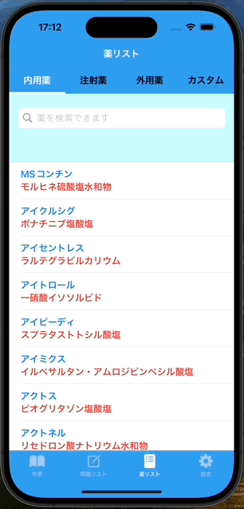
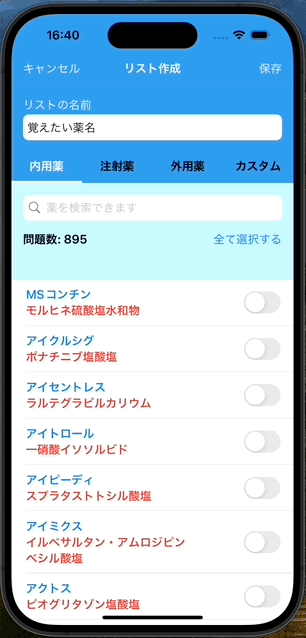
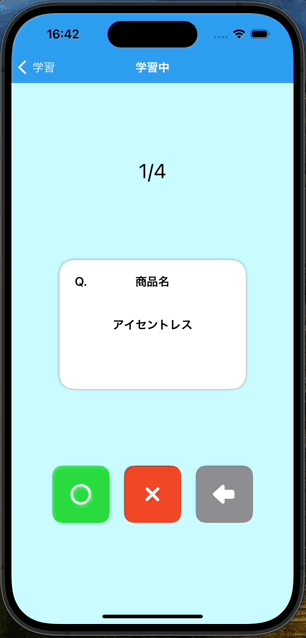
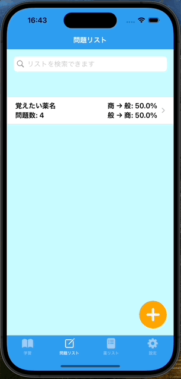
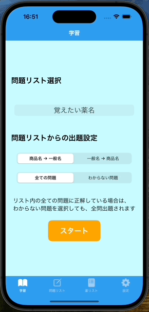
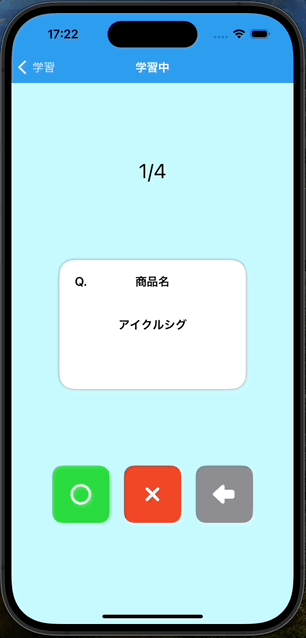

# 薬名暗記カード

## 1. 概要
薬名暗記カードは、薬の名前の暗記学習をサポートするアプリです。 
薬剤師さんは、調剤業務をするために、薬の商品名と一般名の対応関係を覚えます。（例：商品名は「ロキソニン」で一般名は「ロキソプロフェンナトリウム水和物」など） 
しかし、これまで薬の名前を学習するためのツールは無く、薬剤師さんが自分で薬名のリストや暗記カードを作成する必要がありました。 
そこで本プロジェクトでは、薬剤師さんの学習の負担を減らすため、薬の名前の暗記カードのアプリを作成しました。 

## 2. ダウンロードリンク

## 3. アプリの機能
本アプリで扱うことのできる薬の商品名と一般名を確認できるようにするため、薬リストを作成しました。 
薬は沢山あるので、検索できるようにしました。 
 

薬局や病院によって扱っている薬は様々なので、ユーザー個別の問題リストを作成できるようにしました。 
 

暗記カードを使って、学習できるようにしました。 
カードの表面には問題が表示されています。カードをタップすると回転し、裏面の答えが表示されます。 
正解したら、まるボタンを押し、不正解なら、ばつボタンを押します。これにより、結果が記録されます。 
最後に、学習結果を確認できます。 
 

知識の定着具合を後から確認することができるようにするため、学習結果を問題リストに記録するようにしました。 
 

まだ覚えていない薬名だけに絞って効率よく復習できるようにするため、正解できていない問題だけを出題できるようにしました。 
 

## 4. 今後追加する予定の機能
- アプリを使うためのヒントを表示する機能
- 薬リストから選択した薬をWeb検索する機能
- 薬の名前の由来を表示する機能
- クイズ形式での知識の定着度のテスト機能
- 上記のテスト結果のランキング機能

## 5. アプリの設計
本アプリのアーキテクチャにはMVVM（Model-View-ViewModel）を採用しました。

### View
|ファイル名|解説・概要|
|--|--|
|MainTabView|Tab切り替えを実装するメインのView|
|SearchBar|薬名や問題リストの検索バーの汎用的なView|
|NavigationBarBackground|ナビゲーションバーの背景を定義する構造体|
|TextFieldBackground|テキストフィールドの背景を定義する構造体|

学習画面
|ファイル名|解説・概要|
|--|--|
|IntroductionView|初回アプリ起動時に表示する導入画面のView|
|ModeSelectionView|学習に使う問題リストの選択や出題の設定を受け取る画面（学習モード選択画面）のView|
|StudyView|暗記カードを使った学習を提供する画面のView|
|ResultView|学習結果を表示する画面のView|
|AnswerButton|StudyViewで使用する正解ボタン・不正解ボタン・戻るボタンの元となる汎用的なView|
|BannerView|Google AdMobのバナー広告のView|

問題リスト画面
|ファイル名|解説・概要|
|--|--|
|PromptToCreateQuestionListView|ユーザーに問題リストの作成を促す画面のView|
|QuestionListView|ユーザーが作成した問題リストを表示する画面のView|
|QuestionsView|問題リスト内に保存された問題の一覧を表示する画面のView|
|CreateQuestionListView|問題リストを作成・編集する画面のView。ユーザーからの出題する薬名の選択を受け付ける。|
|MedicineSelectableList|問題リストに追加したい薬名を選択するためのToggleボタンの付いたリストのView|

薬リスト画面
|ファイル名|解説・概要|
|--|--|
|MedicineListView|薬名のリストを表示する画面のView|
|AddMedicineView|ユーザー独自の薬名をリストに追加する画面のView|
|TopTabView|上部に付けられるタブのView。薬の分類（内用薬、注射薬、外用薬）を切り替える。|

設定画面
|ファイル名|解説・概要|
|--|--|
|SettingsListView|設定の項目を列挙するリスト画面のView|
|HowToUseView|アプリの使い方に関するリスト画面のView|
|HowToUseStudyView|学習機能の使い方を説明する画面のView|
|HowToUseQuestionListView|問題リスト機能の使い方を説明する画面のView|
|HowToUseMedicineListView|薬リスト機能の使い方を説明する画面のView|
|ReferenceView|アプリで使用されている薬名の引用元を表示する画面のView|

### ViewModel
|ファイル名|解説・概要|
|--|--|
|ModeSelectionViewModel|学習画面で指定された問題リストや出題設定を管理するクラス。その設定の条件にあった問題をCoreDataから取得する。|
|CreateQuestionListViewModel|ユーザーからの情報の入力とそれに基づく問題リストの作成を仲介するクラス。CreateQuestionListModelから問題リストのデータを受け取り、CreateQuestionListViewに表示する。一方で、CreateQuestionListViewでユーザーから受け取った薬名の選択の状態を管理する。この情報を元に問題リストを作成し、CoreDataに保存する。|
|QuestionsViewModel|CoreDataから、保存した問題リストの情報を取得し、QuestionsViewに渡すクラス|
|MedicineListViewModel|ユーザーからの入力に基づき、表示するリストを切り替えるクラス|

### Model
|ファイル名|解説・概要|
|--|--|
|TabSelection|タブの種類を管理する列挙型|
|QuestionListPickerItem|学習モード選択画面で表示される問題リストを管理する構造体|
|StudyMode|学習モード選択画面で「商品名→一般名」と「一般名→商品名」の出題設定を管理する列挙型|
|QuestionSelectionMode|学習モード選択画面で「全ての問題」と「わからない問題」の出題設定を管理する列挙型|
|UserDefaultsKeys|UserDefaultsに値を保持するために使用するキーを管理する列挙型。本アプリでは、ユーザーが指定した出題設定の状態を保持することにより、アプリを閉じて再び開いた際に、前回の出題設定からスタートできる。|
|StudyItem|学習画面で出題する薬名データを管理するための構造体|
|AnswerButtonType|学習で使用する正解ボタン・不正解ボタン・戻るボタンを種類を管理する列挙型|
|StudyResult|学習結果（正解・不正解・未回答）を管理する列挙型|
|CSVLoader|CSVファイルからの薬名データの読み込みを担当するクラス|
|CreateQuestionListModel|CSVファイルから薬名データを、CoreDataからユーザー独自の薬名データを取得し、それらを統合して、問題リスト作成画面に表示するデータを提供するクラス|
|QuestionListMode|問題リスト作成画面で、問題リストを作成するか編集するかの状態を管理する列挙型|
|MedicineListItem|問題リストを作成・編集の際に、薬名のデータが選択・非選択されているかを管理する目的で使用する構造体|
|MedicineItem|薬名データを管理する構造体。商品名と一般名の対応、および、薬のカテゴリを一つのデータにまとめる。|
|MedicineCategory|薬のカテゴリを管理する列挙型。指定されたカテゴリに対応した薬データをCSVファイルから取得するモデルとしての役割も果たす。|
|AddMedicineField|ユーザー独自の薬名をリストに追加する画面（AddMedicineView）でテキストフィールドにフォーカスを当てる機能を管理するための列挙型|
|SettingsListItem|設定の項目を管理する列挙型|
|HowToUse|アプリの使い方に関する項目を管理する列挙型|

### Others
|ファイル名|解説・概要|
|--|--|
|AppDelegate|アプリのライフサイクルイベントを処理するためのデリゲートクラス。本アプリでは、アプリの起動時に、Google AdMobのバナー広告の初期化を行う。また、初回のみ、ユーザーへのトラッキングの許可をリクエストする。|
|Persistence|CoreDataで使用するPersistentControllerの構造体を定義する。|

## 6. MVVMの構成図

## 7. シーケンス図

## 8. E-R図

## 9. 工夫したコード
### Concurrencyを利用して、カードがめくられる動作を実装しました。
カードがめくられる様子 
 

めくられるカードを実装したコード
https://github.com/CodeCandySchool/MedicineNameQuiz_Sagae/blob/ab7f0e6466e8ee29618a42fa0331f17ac3346b8f/MedicineNameQuiz_Sagae/View/Study/StudyView.swift#L46-L54
https://github.com/CodeCandySchool/MedicineNameQuiz_Sagae/blob/c900f9256685f46a0dbc441c500abddc7078ac06/MedicineNameQuiz_Sagae/View/Study/StudyView.swift#L151-L230

解説

## 10. その他リンク
- [アプリ紹介ホームページ](https://tas5521.github.io/MedicineNameQuiz/index.html) 
- [作成者のXアカウント](https://x.com/ta_s11152) 
- [薬名のリストの作成するためにPythonで作成したデスクトップアプリ](https://github.com/tas5521/CreateMedicineNameDataSet) 
- [作成中の他のアプリ（数独ソルバー）](https://github.com/tas5521/SudokuSolver)